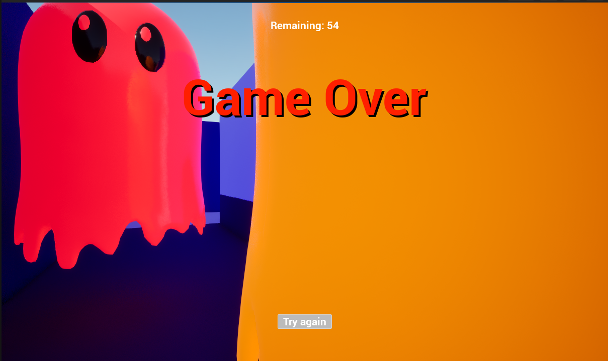

# Pacman

A Pac-Man clone built in Unreal Engine 5.7 using Blueprints.

## Overview

Navigate the maze, collect all the pellets, and avoid the ghosts. Collect every pellet to win; get caught and it's game over.

## Requirements

- Unreal Engine **5.7**

## Getting Started

1. Clone the repository.
2. Open `Pacman.uproject` in Unreal Engine 5.7.
3. Open the `L_Maze` level under `Content/Levels/`.
4. Press **Play** in the editor.

## Controls

Input mappings live in `Content/Input/`:

- `IMC_Default` — default input mapping context
- `IA_Move` — movement
- `IA_Look` — look / camera

## Project Layout

- `Content/Blueprints/` — gameplay Blueprints (player, ghosts, pellets, walls, HUD, game mode, win/game-over screens)
- `Content/Levels/L_Maze` — the playable maze level
- `Content/Ghost/` — ghost mesh and per-colour material instances (Red, Pink, Cyan, Orange)
- `Content/Materials/` — shared materials for the floor, walls, pellets, and ghosts
- `Content/Input/` — Enhanced Input assets

## Gameplay Features

- Player movement and camera controls
- Maze with pellets and a pellet counter on the HUD
- Four ghosts with basic chase AI
- Custom ghost collision so ghosts can pass through the ghost-house wall
- Win screen on collecting all pellets
- Game over screen with a **Try again** button
